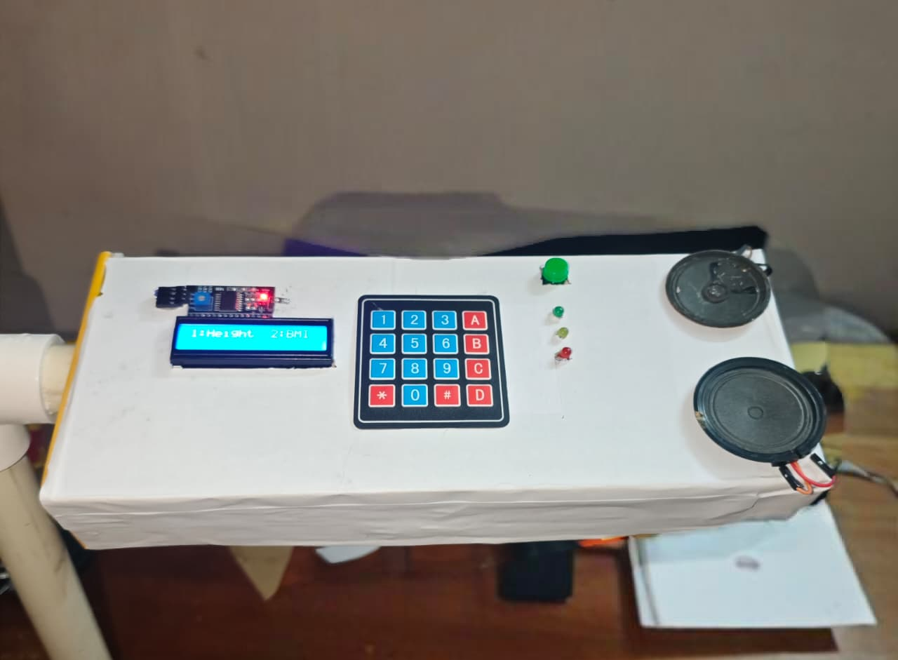
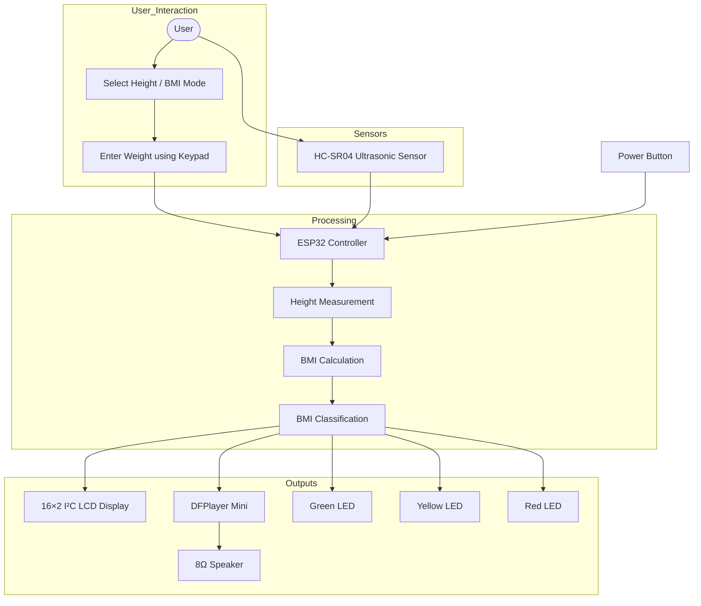
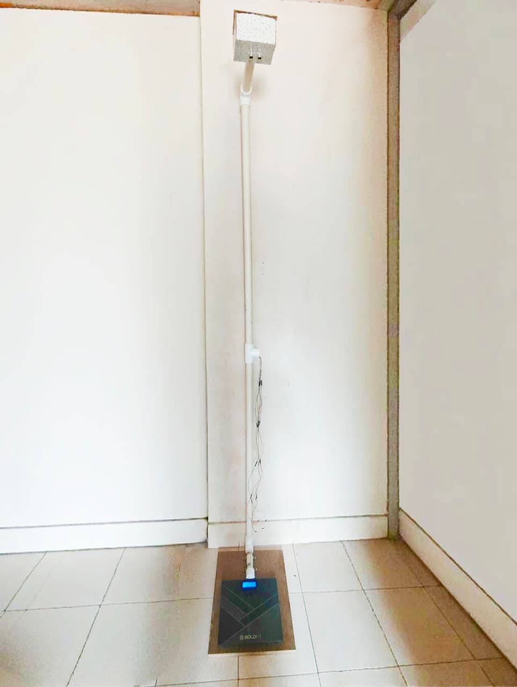
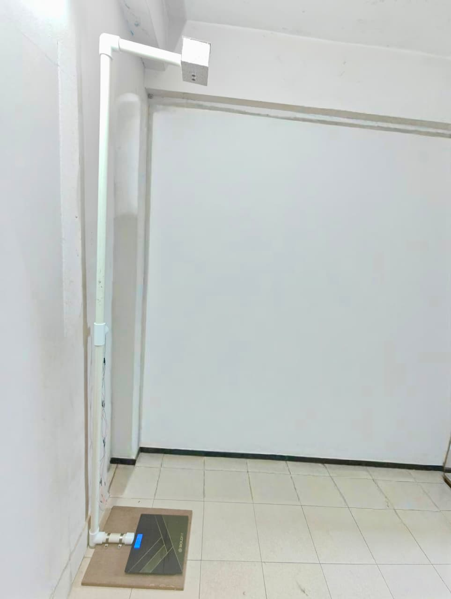
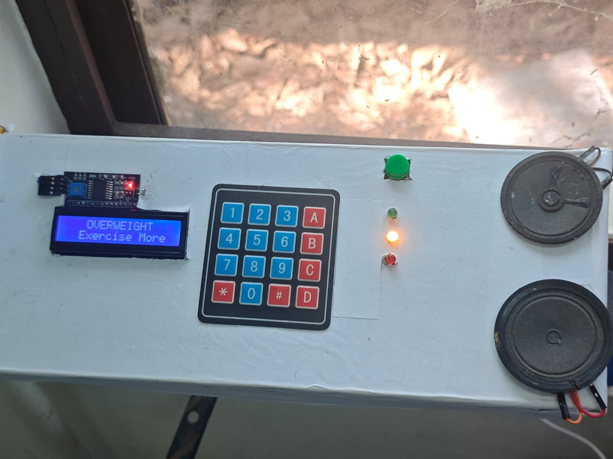
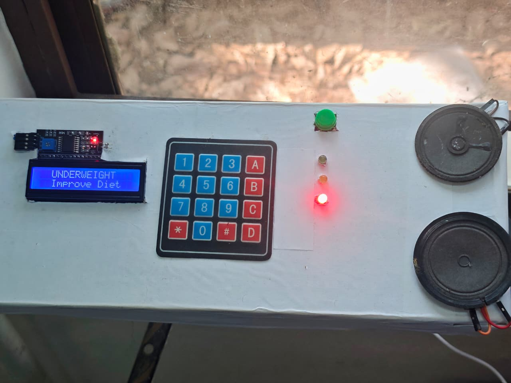
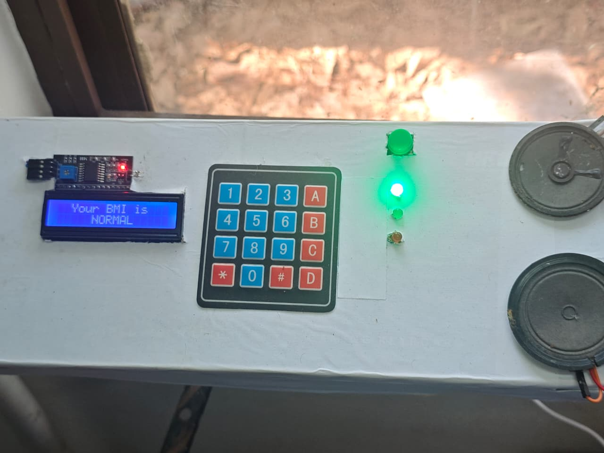
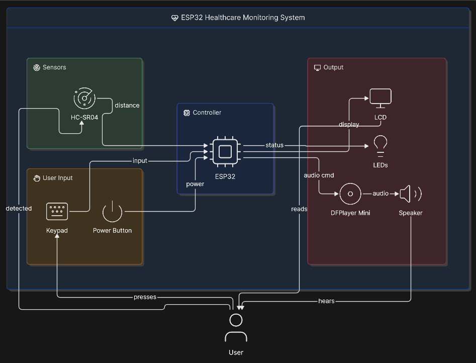

<div align="center">

# 📏 Smart Height & BMI Measurement System

### ESP32-Based Intelligent Healthcare Monitoring System


<br>



### *A Smart Embedded Healthcare Prototype capable of measuring human height, calculating BMI, providing voice guidance and displaying health information using ESP32.*

</div>

---

# 📖 Overview

The **Smart Height & BMI Measurement System** is an embedded healthcare project developed using the **ESP32** microcontroller.

The system automatically measures a user's **height** using an **HC-SR04 Ultrasonic Sensor** and calculates **Body Mass Index (BMI)** after the user enters their weight through a **4×4 Matrix Keypad**.

To enhance user interaction, the system provides **voice guidance** using a **DFPlayer Mini MP3 Module**, displays results on a **16×2 I²C LCD** and indicates the BMI category using **LED indicators**.

This project demonstrates embedded systems, sensor interfacing, serial communication and user-friendly healthcare automation.

---

# ✨ Features

- 📏 Automatic Height Measurement
- ⚖️ BMI Calculation
- ⌨️ Manual Weight Entry using 4×4 Matrix Keypad
- 🔊 Voice Guidance using DFPlayer Mini
- 📺 16×2 I²C LCD Display
- 💡 BMI Status Indication using LEDs
- 🔘 Power Button Control
- 🎤 Spoken Height & BMI Results
- ⚡ ESP32 Based Embedded System
- 💰 Low-Cost Portable Design

---

# 🛠 Hardware Components

| Component | Quantity |
|-----------|----------|
| ESP32 Development Board | 1 |
| HC-SR04 Ultrasonic Sensor | 1 |
| DFPlayer Mini | 1 |
| 8Ω Speaker | 1 |
| 16×2 I²C LCD Display | 1 |
| 4×4 Matrix Keypad | 1 |
| Push Button | 1 |
| Green LED | 1 |
| Yellow LED | 1 |
| Red LED | 1 |
| Breadboard / PCB | 1 |
| Jumper Wires | As Required |
| 5V USB Power Supply | 1 |

---

# ⚙️ System Architecture



---

# 🔄 Working Principle

1. User powers on the system.
2. The system welcomes the user through voice guidance.
3. The user selects either **Height Measurement** or **BMI Mode**.
4. In BMI mode, the user enters weight using the keypad.
5. The ultrasonic sensor measures the user's height.
6. ESP32 processes the measured height.
7. BMI is calculated using the entered weight.
8. Height and BMI are displayed on the LCD.
9. Voice guidance announces the measured height and BMI.
10. LEDs indicate the BMI category:

- 🟢 Normal
- 🟡 Overweight
- 🔴 Underweight / Obese

---

# 📂 Repository Structure

```
Smart-Height-and-Weight-Measurement-System
│
├── Code/
│   └── Smart_Height_BMI_System.ino
│
├── Images/
│   ├── Prototype1.jpg
│   ├── Prototype2.jpg
│   ├── Prototype3.jpg
│   ├── LCD1.jpg
│   ├── LCD2.jpg
│   ├── LCD3.jpg
│   └── Architecture.png
│
├── Videos/
│   └── Demo.mp4
│
├── README.md
├── LICENSE
└── .gitignore
```

---

# 📚 Libraries Used

- Wire
- LiquidCrystal_I2C
- Keypad
- HardwareSerial
- DFRobotDFPlayerMini

---

# 💻 Software Used

- Arduino IDE
- ESP32 Board Package
- C++
- Git
- GitHub

---

# 🎯 Applications

- Healthcare Monitoring
- Schools & Colleges
- Fitness Centers
- Hospitals
- Health Camps
- Embedded Systems Education
- BMI Screening Kiosks

---

# 📸 Project Gallery

## 🖥 Prototype

<p align="center">


</p>

---

## 📺 LCD Display

<p align="center">



</p>

---

## 🏗 System Architecture

<p align="center">

</p>

---

# 🎥 Demonstration

A complete demonstration video of the Smart Height & BMI Measurement System is available in the **Videos** folder.

📹 **Demo Video**

```
Videos/Demo.mp4
```

---

#  Future Enhancements

-  Automatic Weight Measurement using Load Cells
-  AWS IoT Cloud Integration
-  Web Dashboard
-  Mobile Application
-  User Health History
-  AI-Based Health Recommendations
-  Wi-Fi Data Logging
-  Automatic Waist-to-Hip Ratio Measurement
-  Health Report Generation

---

# 📝 Version Information

## ✅ Version 1.0

- Automatic Height Measurement
- Manual Weight Entry
- BMI Calculation
- Voice Guidance
- LCD Display
- LED Health Status
- Power Button Control

---

## 🚀 Planned Version 2.0

- Automatic Weight Measurement
- Cloud Connectivity (AWS IoT)
- Mobile Application
- User Database
- Smart Health Reports

---

# 🤝 Contributing

Contributions, ideas and improvements are always welcome.

Feel free to fork this repository and submit a Pull Request.

---

# 👥 Project Team

This project was developed as a collaborative Mini Project by:

| Name | Role |
|------|------|
| **S. Pravin Raj** | ESP32 Programming, System Integration & GitHub Repository |
| **Praveena Prem** | Documentation & System Architecture|
| **[Y. Ameesh Khan](https://github.com/Ameeshkhan47)** | Documentation & System Architecture|
| **Yadhu Raj R** | System Designer |

Department of Computer Science & Engineering
Mohandas College of Engineering and Technology

---

# 👨‍💻 Repository Maintainer

**S. Pravin Raj**

Computer Science Engineering Student

### Interests

- Cloud Computing
- AWS
- Computer Networking
- Embedded Systems
- Internet of Things (IoT)
- Hardware Development

<div align="center">

##  If you found this project useful, don't forget to Star this repository!

### Made with  using ESP32

</div>
